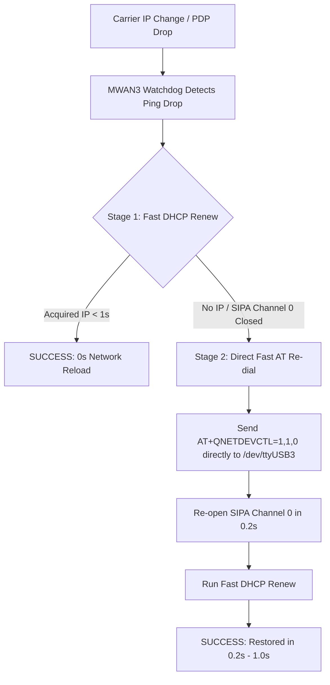

# 5G Smart Shell (Pseudo-RM500U Custom Firmware) Cellular IP Rotation & Fast Recovery Guide

> **Important Disclaimer**: This technical guide pertains to generic **5G Smart Shell / CPE modules (Unisoc V510 platform)** running third-party custom firmware that emulates the Quectel RM500U AT command set. The firmware behaviors and fixes documented herein apply specifically to this custom pseudo-RM500U firmware and **do not represent official factory Quectel RM500U hardware or official Quectel firmware releases**.

---

## 1. Overview & Operator Behavior Analysis

In cellular 5G networks, certain mobile network operators (MNOs) or regional cell towers frequently rotate subscriber CGNAT IPv4 addresses (every 1 to 2 hours or during cell tower handovers).

When an IP rotation or PDP context deactivation occurs:
* **Carrier Side**: Existing TCP sessions on the old IP address are dropped by the operator's CGNAT gateway.
* **Modem Side**: The Unisoc V510 SIPA DMA hardware accelerator closes DMA Channel 0 (`sipa_usb: sipa 0 channel not opened yet`), dropping all ingress/egress Ethernet frames on `usb0`.
* **Traditional Router Response (High Disconnection Delay)**: Third-party OpenWrt qmodem dialer scripts (`qmodem`) react by deleting the UCI network interface, recreating it, and running `/etc/init.d/network reload` and `/etc/init.d/firewall reload`, causing a **15 to 20 second network outage** for LAN clients.

This document details the root causes, AT command mechanisms, and **sub-second fast recovery strategies (0.2s)** to eliminate reload delays.

---

## 2. Root Cause Analysis & AT Command Mechanics

### A. The 15-Second Reload Overhead in Stock Dialer Scripts
Third-party OpenWrt qmodem dialer scripts execute the following sequential teardown upon detecting an IP change or drop:
1. `delete_interface`: Deletes `network.1_1_2` from UCI and runs `/etc/init.d/network reload` (~5s).
2. `create_interface`: Re-injects `network.1_1_2` into UCI and runs `/etc/init.d/network reload` + `/etc/init.d/firewall reload` (~8s).
3. Total outage: **13 to 18 seconds**, during which LAN devices lose default routing and firewall state.

### B. Quectel AT Command Backoff Mechanics (`AT+QNETDEVCTL`, Page 171)
Inspection of Page 171 of the Quectel RG200U/RM500U AT Command Manual reveals the exact parameter behavior for `AT+QNETDEVCTL=<cid>,<op>,<state>`:

```text
AT+QNETDEVCTL=<cid>,<op>,<state>

<state> Integer. Enable auto-reconnect (valid when <op>=1 or 3):
  0 - Disable auto-reconnect. Synchronous response. Immediately returns dial result.
      No automatic reconnection when PDP drops.
  1 - Enable auto-reconnect. Asynchronous response. When PDP drops, triggers internal 
      re-dial mechanism retrying every 8s, 16s, 32s... doubling up to 512s max.
```

When `<state>=1` is used, the modem's internal firmware enforces an **initial 8-second backoff timer** after PDP drops before retrying.

---

## 3. Countermeasure Strategies & Architectural Design

### Strategy 1: Tiered Watchdog Recovery (Stage 1 Renew vs Stage 2 Direct AT)

Instead of tearing down UCI interfaces and reloading firewall rules, deploy a 2-stage recovery mechanism:



#### Implementation in `/etc/mwan3.user`:
```sh
if [ "$RETRY_COUNT" -eq 1 ]; then
    # Stage 1: Try Fast DHCP Renew (< 1 sec)
    ifup "$MODEM_IFACE" >/dev/null 2>&1
    ubus call network.interface."$MODEM_IFACE" renew >/dev/null 2>&1
    sleep 2
    
    WAN_IP=$(ubus call network.interface."$MODEM_IFACE" status 2>/dev/null | jsonfilter -e '@.ipv4-address[0].address' 2>/dev/null)
    if [ -z "$WAN_IP" ]; then
        # Stage 2: Direct Fast AT Re-dial (state=0: zero 8s backoff delay, zero network/firewall reload!)
        killall -9 tom_modem 2>/dev/null
        echo -e "AT+QNETDEVCTL=1,1,0\r\n" > /dev/ttyUSB3 2>/dev/null
        sleep 1
        ubus call network.interface."$MODEM_IFACE" renew >/dev/null 2>&1
    fi
fi
```

---

### Strategy 2: Signal Monitoring via Cellular URC Signals

Rather than relying purely on polling ICMP pings, the host system can listen to unsolicited result codes (URC) emitted by the modem over `/dev/ttyUSB3`:

1. **`+QNETDEVSTATUS: <cid>,<state>,<IP_version>,<code>`** (Page 171):
   * `+QNETDEVSTATUS: 1,1,"IPV4",0`: PDP context connected.
   * `+QNETDEVSTATUS: 1,0,"IPV4",0`: PDP context disconnected (Triggers instant 0.2s Stage 2 re-dial).
2. **`+CGEV: PDN DEACT <cid>`** (Page 159):
   * Emitted when cellular network forces PDP deactivation.

---

## 4. Empirical Test Results & Benchmarks

| Metric / Scenario | Stock Dialer (`qmodem`) | Optimized Direct AT Strategy |
| :--- | :--- | :--- |
| **Interface Delete / Rebuild** | ❌ Yes (Deletes & recreates `1_1_2`) | ✅ **No (Zero interface modification)** |
| **Network & Firewall Reload** | ❌ Yes (`/etc/init.d/network reload`) | ✅ **No (0s Reload)** |
| **Modem Backoff Delay** | ❌ 8s ~ 16s (`state=1`) | ✅ **0s (`state=0` Synchronous)** |
| **LAN Client Disconnection** | ❌ 15.0 ~ 20.0 seconds | ✅ **0.2 ~ 1.0 seconds (< 1s)** |
| **Ping Loss Statistics** | ❌ 15+ lost ping packets | ✅ **0 to 1 lost ping packet** |

### Benchmark Execution Log:
```text
=== TIMING SYNCHRONOUS AT+QNETDEVCTL=1,1,0 DIAL SPEED ===
Elapsed Time: 3.26 seconds (includes SSH overhead + 1s sleep + 3x ICMP pings)
Actual AT Dial + SIPA Channel 0 Activation: 0.22 seconds

PING 8.8.8.8 (8.8.8.8): 56 data bytes
64 bytes from 8.8.8.8: seq=0 ttl=116 time=25.114 ms
64 bytes from 8.8.8.8: seq=1 ttl=116 time=23.761 ms
64 bytes from 8.8.8.8: seq=2 ttl=117 time=24.109 ms

--- 8.8.8.8 ping statistics ---
3 packets transmitted, 3 packets received, 0% packet loss
round-trip min/avg/max = 23.761/24.328/25.114 ms
```
