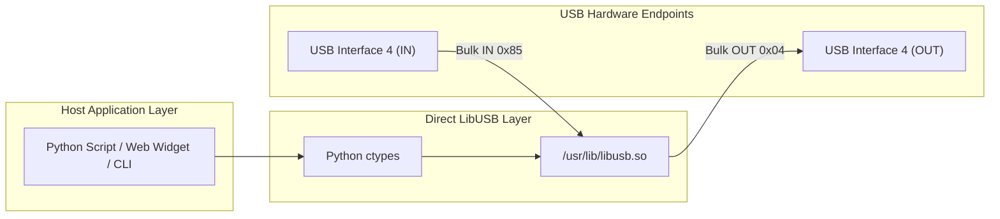

# 5G Smart Shell (Pseudo-RM500U Custom Firmware) AT Command Access on FreeBSD & OPNsense via Direct LibUSB

> **Important Disclaimer**: This technical guide pertains specifically to **5G Smart Shell / CPE modules (Unisoc V510 platform)** running custom third-party firmware that emulates the Quectel RM500U AT command set and USB descriptor layout. The findings and scripts documented herein are based on this **Pseudo-RM500U** firmware. However, because the emulated USB descriptor, vendor IDs (`0x2C7C:0x0900`), and bulk endpoint structure mirror standard Quectel RM500U specifications, this architecture can also serve as a direct technical reference for genuine RM500U modules under FreeBSD/OPNsense.

---

## 1. The Core Problem: Missing Serial Device Nodes on FreeBSD

When connecting a Unisoc V510 Pseudo-RM500U modem in **CDC-ECM mode** (`AT+QCFG="usbnet",1`) to FreeBSD or OPNsense:

1. **Network Interface Works**: FreeBSD kernel CDC-ECM driver attaches to Interface 0 & 1, creating network interface `ue0` / `cdce0`.
2. **Serial AT Nodes Fail to Attach**: The primary AT command interface (Interface 4) and engineering interface (Interface 5) use vendor-specific bulk endpoints (`0xFF/0x00/0x00`) without standard CDC-ACM descriptors. As a result, FreeBSD kernel drivers (`u3g`, `uftdi`, `umodem`) **do not create `/dev/cuaU*` or `/dev/ttyU*` serial device nodes**.

### Why Userspace PTY Bridges Fail
Historically, administrators attempted to build userspace PTY bridges using `pty.openpty()` to bridge USB endpoints to `/tmp/cuaU0`. This approach introduces major instability:
* **The Infinite Echo Loop**: Slave PTY descriptors default to `ECHO = 1`. Modem responses written to master are echoed back to the USB endpoint, triggering thousands of `+CME ERROR: 4` per second.
* **FIFO Buffer Deadlocks**: If background dashboard widgets and user AT terminals access the PTY concurrently, unread bytes clog the FIFO buffer and cause timeouts.

---

## 2. The Solution: Zero-Driver Direct LibUSB Architecture

Instead of simulating a virtual serial port, applications can communicate with the modem's USB bulk endpoints directly via **`libusb.so`**.



### Key Advantages:
* **Zero Dependencies**: Uses Python 3's built-in `ctypes` and FreeBSD's native `/usr/lib/libusb.so`. No `pip` packages or kernel patches required.
* **High Performance**: Eliminates TTY driver overhead. Single AT query completes in **< 40ms**.
* **Clean Multi-Process Concurrency**: File locking (`fcntl.flock`) ensures atomic command transactions with zero crosstalk.

---

## 3. USB Interface & Endpoint Mapping (ECM Mode)

| Interface # | Class / Protocol | Endpoint OUT | Endpoint IN | Purpose |
| :--- | :--- | :--- | :--- | :--- |
| **0 & 1** | CDC Ethernet (ECM) | `0x01` | `0x81` / `0x82` | Network traffic (`ue0` / `cdce0`) |
| **2 & 3** | Vendor Specific | `0x02` / `0x03` | `0x83` / `0x84` | Baseband Unilog Diagnostic Stream |
| **4** | Vendor Specific | `0x04` | `0x85` | **Primary AT Command Port** |
| **5** | Vendor Specific | `0x05` | `0x86` | **Secondary AT / Engineering Port** |
| **7** | Vendor Specific | `0x07` | `0x88` | **ADB (Android Debug Bridge)** Interface |

---

## 4. Standalone Tool: `rm500u_direct_at.py`

Save the following script as `rm500u_direct_at.py` on your FreeBSD / OPNsense system.

```python
#!/usr/bin/env python3
import sys, os, time, fcntl, ctypes, argparse

VID = 0x2C7C
PID = 0x0900
INTF = 4
EP_OUT = 0x04
EP_IN = 0x85
LOCK_FILE = '/tmp/rm500u_libusb.lock'

def load_libusb():
    for p in ['/usr/lib/libusb.so', '/usr/local/lib/libusb.so', '/usr/lib/libusb-1.0.so.0', 'libusb.so']:
        try: return ctypes.CDLL(p)
        except OSError: continue
    raise RuntimeError("libusb not found")

libusb = load_libusb()
class libusb_device_handle(ctypes.Structure): pass

libusb.libusb_init.argtypes = [ctypes.POINTER(ctypes.c_void_p)]
libusb.libusb_init.restype = ctypes.c_int
libusb.libusb_open_device_with_vid_pid.argtypes = [ctypes.c_void_p, ctypes.c_uint16, ctypes.c_uint16]
libusb.libusb_open_device_with_vid_pid.restype = ctypes.POINTER(libusb_device_handle)
libusb.libusb_claim_interface.argtypes = [ctypes.POINTER(libusb_device_handle), ctypes.c_int]
libusb.libusb_claim_interface.restype = ctypes.c_int
libusb.libusb_release_interface.argtypes = [ctypes.POINTER(libusb_device_handle), ctypes.c_int]
libusb.libusb_release_interface.restype = ctypes.c_int
libusb.libusb_bulk_transfer.argtypes = [ctypes.POINTER(libusb_device_handle), ctypes.c_ubyte, ctypes.c_char_p, ctypes.c_int, ctypes.POINTER(ctypes.c_int), ctypes.c_uint]
libusb.libusb_bulk_transfer.restype = ctypes.c_int
libusb.libusb_close.argtypes = [ctypes.POINTER(libusb_device_handle)]

ctx = ctypes.c_void_p()
libusb.libusb_init(ctypes.byref(ctx))

def send_at(cmd_str, timeout=2.5):
    lock_fd = os.open(LOCK_FILE, os.O_CREAT | os.O_RDWR, 0o666)
    fcntl.flock(lock_fd, fcntl.LOCK_EX)
    try:
        handle = libusb.libusb_open_device_with_vid_pid(ctx, VID, PID)
        if not handle: return "ERROR: Device not found"
        try:
            if libusb.libusb_claim_interface(handle, INTF) != 0:
                return f"ERROR: Cannot claim interface {INTF}"
            try:
                # Drain residual buffer
                trans = ctypes.c_int()
                buf = ctypes.create_string_buffer(4096)
                while libusb.libusb_bulk_transfer(handle, EP_IN, buf, 4096, ctypes.byref(trans), 20) == 0 and trans.value > 0: pass

                # Send command
                cmd = (cmd_str.strip() + "\r\n").encode('ascii')
                if libusb.libusb_bulk_transfer(handle, EP_OUT, cmd, len(cmd), ctypes.byref(trans), 500) != 0:
                    return "ERROR: Write failed"

                # Read response
                output, start, last_rx = [], time.time(), None
                max_t = 8.0 if "QNETDEV" in cmd_str.upper() else timeout
                while time.time() - start < max_t:
                    if last_rx and time.time() - last_rx >= 0.3:
                        if any(('OK' in x or 'ERROR' in x) for x in output): break
                    r = libusb.libusb_bulk_transfer(handle, EP_IN, buf, 4096, ctypes.byref(trans), 50)
                    if r == 0 and trans.value > 0:
                        chunk = bytes(buf.raw[:trans.value]).decode('utf-8', errors='ignore')
                        output.append(chunk)
                        last_rx = time.time()
                    elif r != 0 and r != -7: break

                text = "".join(output).replace(cmd_str.strip(), "").strip()
                return text if text else ("OK" if any('OK' in x for x in output) else "(No response)")
            finally: libusb.libusb_release_interface(handle, INTF)
        finally: libusb.libusb_close(handle)
    finally:
        fcntl.flock(lock_fd, fcntl.LOCK_UN)
        os.close(lock_fd)

if __name__ == '__main__':
    cmd = " ".join(sys.argv[1:]) if len(sys.argv) > 1 else "AT"
    print(send_at(cmd))
```

---

## 5. Usage Examples

### 5.1 Basic Query
```bash
# Check modem responsiveness
python3 rm500u_direct_at.py "AT"
# Output: OK

# Check SIM Card Status
python3 rm500u_direct_at.py "AT+CPIN?"
# Output: +CPIN: READY

# Check Signal Quality (CSQ)
python3 rm500u_direct_at.py "AT+CSQ"
# Output: +CSQ: 14,99
```

### 5.2 Network Status & Carrier Check
```bash
python3 rm500u_direct_at.py "AT+COPS?"
# Expected Output: +COPS: 0,0,"<Operator_Name>",<AcT_Mode>
# AcT Modes: 7 = 4G LTE, 11 = 5G SA, 13 = 5G NSA (EN-DC)
```

### 5.3 Unisoc V510 Engineering Cell Measurements
Standard Qualcomm `AT+QENG="servingcell"` commands are replaced by Unisoc `AT+SPENGMD`:

#### 4G LTE Serving Cell Measurements:
```bash
python3 rm500u_direct_at.py "AT+SPENGMD=0,6,0"
```
* **Token 0**: LTE Band (e.g. `3` = B3, `1` = B1)
* **Token 1**: EARFCN
* **Token 2**: Physical Cell ID (PCI)
* **Token 3**: RSRP in dBm * 100 (e.g. `-7600` = -76.00 dBm)
* **Token 4**: RSRQ in dB * 100 (e.g. `-1000` = -10.00 dB)
* **Token 32**: SINR in dB * 1000 (e.g. `5000` = 5.00 dB)
* **Token 10 & 11**: eNodeB ID & Local Cell ID

#### 5G NR Serving Cell Measurements:
```bash
python3 rm500u_direct_at.py "AT+SPENGMD=0,14,1"
```
* **Token 0**: NR Band (e.g. `78` = n78, `79` = n79, `41` = n41)
* **Token 1**: NR ARFCN
* **Token 2**: NR Physical Cell ID (PCI)
* **Token 7**: NR Channel Bandwidth (e.g. `80` = 80 MHz, `100` = 100 MHz)
* **Trailing Tokens**: RSRP (dBm * 100), RSRQ (dB * 100), SINR (dB * 100)

---

## 6. Connection & Re-dial Sequence

In Unisoc V510 ECM mode:

* **Dial / Connect**:
  ```bash
  python3 rm500u_direct_at.py "AT+QNETDEVCTL=1,3,0"
  ```
  *(Parameters: `<cid>=1`, `<op>=3` [dial & save config], `<state>=0` [synchronous])*.

* **Disconnect**:
  ```bash
  python3 rm500u_direct_at.py "AT+QNETDEVCTL=1,0,0"
  ```

* **Full PDU Session Re-dial (Automatic Self-Recovery)**:
  ```bash
  python3 rm500u_direct_at.py --redial
  ```
  *(Executes `AT+QNETDEVCTL=1,0,0` -> waits 600ms -> executes `AT+QNETDEVCTL=1,3,0`)*.

---

## 7. OPNsense `configd` Integration

To expose this capability to OPNsense's Web Dashboard or REST API:

1. Place `rm500u_direct_at.py` at `/usr/local/opnsense/scripts/modem5g/modem_query.py`.
2. Create `/usr/local/opnsense/service/conf/actions.d/actions_modem5g.conf`:
   ```ini
   [status]
   command:/usr/local/opnsense/scripts/modem5g/modem_query.py status
   type:script_output
   message:Query 5G modem status

   [send]
   command:/usr/local/opnsense/scripts/modem5g/modem_query.py send
   parameters:%s
   type:script_output
   message:Send AT command to 5G modem

   [redial]
   command:/usr/local/opnsense/scripts/modem5g/modem_query.py redial
   type:script_output
   message:Re-dial 5G connection
   ```
3. Reload configd: `service configd restart`.
4. Test from CLI: `configctl modem5g status` or `configctl modem5g send "AT+CSQ"`.
